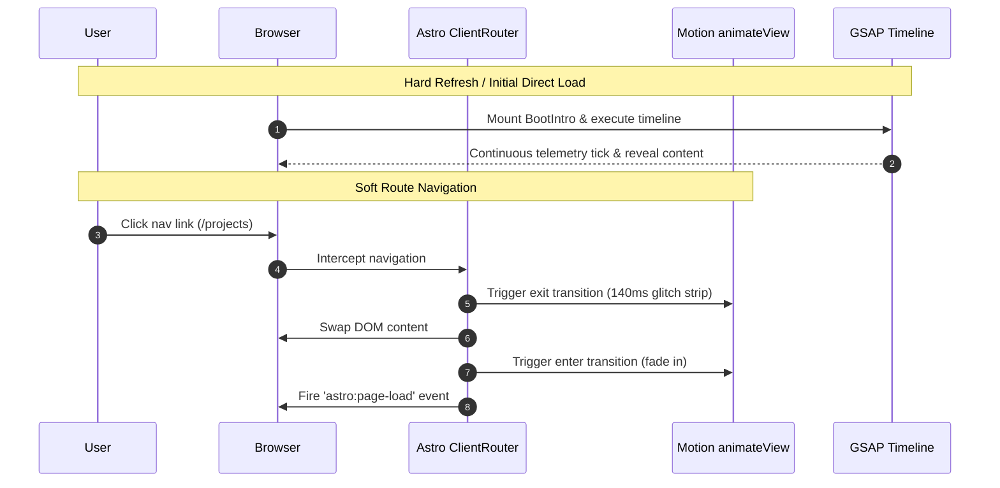

# Animation & Transition Specification (`ANIMATION_SPEC.md`)

**Site Context:** `manikandanx0.tech`  
**Aesthetic:** Astro static site, terminal / dispatch / cyberpunk aesthetic (`SYS_ID`, `clearance level`, `telemetry`, monospace typography, ASCII-adjacent chrome).  
**Routes:** `/`, `/projects`, `/writing`, `/writing/blog/[slug]`, `/writing/ctf/[slug]`, `/writing/leetcode/[slug]`, `/projects/[slug]`, `/about`, `/404`.

---

## 1. Executive Summary & Design Decisions

This document outlines the animation architecture for `manikandanx0.tech`. All decisions documented below have been finalized and must be adhered to during implementation.

### Boot Intro (Page Load Orchestration)
* **Frequency:** Plays on **every page load** (hard refresh / initial visit), not once per session.
* **Concept:** Terminal boot sequence with status lines resolving (e.g., `INITIALIZING`, `AUTH: GUEST`, `CLEARANCE: LEVEL 3`, `SYSTEM ONLINE`), directly tying into the homepage line `// SYS_ID: MANI-2026-DX ● ONLINE // DISPATCH READY`.
* **Motion Guarantee:** Must stay in continuous motion the entire time (typing cursor, subtle flicker, ticking telemetry values). **No static or frozen frames** at any point prior to reveal.
* **Engine:** Built with **GSAP** (timeline-driven sequence, independent of client routing).

### Page Transitions (Route Switch Choreography)
* **Style:** **"Tamed Glitch"** — a short glitch burst confined to a horizontal strip across the view (not full-viewport), taking ~140ms, with the actual page content resolving underneath in a clean opacity fade.
* **Rejected Alternative:** Full-viewport flash/strobe glitch was explicitly rejected to avoid WCAG 2.3.1 violations (flashing thresholds) and discomfort for motion-sensitive visitors.
* **Reduced Motion:** Fully respects `prefers-reduced-motion: reduce`. The fallback is a clean **~200ms opacity fade** (no horizontal strip, no transform jitter, no flickering), implemented as a formal logic branch in code.
* **Routing Backbone:** Astro native `<ClientRouter />` (View Transitions API), chosen over Barba.js for native Astro integration, built-in fallback, and lightweight footprint.
* **Transition Engine:** Motion's `animateView()` (from the `motion` package). Native view-transition-name scoping, keyframe `.enter()` / `.exit()` mapping for the horizontal strip, and automatic interruption handling when users rapidly navigate between routes.
* **Browser Ceiling:** Supported natively in Chromium and Safari 18+. Browsers lacking View Transitions API support automatically degrade to the reduced-motion style plain fade.

### Why GSAP AND Motion (Dual Engine Architecture)
| Engine | Dedicated Scope | Rationale |
| :--- | :--- | :--- |
| **GSAP** | **Boot Intro Only** | Exceptional timeline choreography, precise keyframing of text/telemetry ticks, zero requirement for DOM diffing or page transition lifecycle hooks. |
| **Motion (`animateView()`)** | **Route Transitions Only** | Built specifically on top of the browser View Transitions API. Solves element scoping, exit/enter keyframes, and rapid-click cancellation without manual DOM cleanup. |

*Note for future maintainers: Do NOT attempt to consolidate these into a single library. Each tool is selected for its specialized domain.*

---

## 2. Technical Architecture & Lifecycle Integration

### Component & File Locations
```
src/
├── components/
│   └── animation/
│       ├── BootIntro.astro       # GSAP terminal boot overlay component
│       └── TransitionGlitch.astro# Motion animateView helper & strip container
├── lib/
│   └── animation/
│       ├── bootSequence.ts       # GSAP timeline setup & telemetry tick logic
│       └── routeTransitions.ts   # Motion animateView configuration & reduced motion check
├── styles/
│   └── animation.css            # Glitch strip keyframes, view-transition pseudos, reduced motion overrides
```

### Lifecycle Hooks & Execution Flow
1. **Initial Page Mount (`DOMContentLoaded` / First Paint):**
   - `BootIntro.astro` checks `sessionStorage` or page load state.
   - GSAP timeline initiates boot animation over top of hidden layout content.
   - Upon GSAP `onComplete`, boot veil resolves, unveiling main page content.
2. **Client Router Initialization (`astro:before-swap` & `astro:page-load`):**
   - `<ClientRouter />` intercepts link clicks.
   - `astro:before-swap` triggers Motion `animateView()` exit state (140ms horizontal glitch strip scan or reduced-motion fade).
   - DOM update completes; `astro:page-load` fires `animateView()` enter transition and re-initializes page-specific scripts (e.g. filters, canvas scripts).



---

## 3. File-by-File Implementation Plan

| Path | Action | Description |
| :--- | :--- | :--- |
| `package.json` | **Modify** | Add dependencies: `gsap` and `motion`. |
| `src/layouts/BaseLayout.astro` | **Modify** | Import `<ClientRouter />` from `astro:transitions` into `<head>`. Insert `<BootIntro />` overlay and load `routeTransitions.ts`. |
| `src/components/animation/BootIntro.astro` | **Create** | Cyberpunk terminal boot overlay HTML structure, status text lines, and canvas scanline container. |
| `src/lib/animation/bootSequence.ts` | **Create** | GSAP timeline choreography, randomized hex/telemetry number counters, and reveal easing. |
| `src/lib/animation/routeTransitions.ts` | **Create** | Setup wrapper for Motion `animateView()`, handling `prefers-reduced-motion` branching and fallback logic. |
| `src/styles/animation.css` | **Create** | Keyframes for horizontal glitch strip, `::view-transition-old()` and `::view-transition-new()` CSS overrides. |
| `src/styles/global.css` | **Modify** | Import `animation.css`. |

---

## 4. Prerequisites & Known Codebase Issues

Before or alongside animation implementation, the following codebase issues must be addressed:

### Prerequisite 1: Shared Spacing / Telemetry Chip Bug
* **Issue:** Text-extraction and layout audits revealed several locations where distinct data elements render glued together without proper whitespace or CSS gap (e.g. `● ONLINE`, tag chips running into each other, stat numbers attached to labels).
* **Impact:** Reusing these tag and stat structures inside new animated components (e.g., `BootIntro` telemetry streams) will propagate the spacing flaw across the site.
* **Fix Plan:** Standardize gap/margin utility rules on `.tag`, `.telemetry-pill`, `.telem-metric`, and `.status-dot` containers in `global.css` prior to building animation markup.

### Prerequisite 2: Color Contrast Audit (Open Requirement)
* **Issue:** Color contrast ratios across terminal labels (`--muted`: `#a3a8d4`, `--dim`: `#525684`, `--border2`: `#403472`) have not yet been evaluated for WCAG AAA/AA compliance.
* **Impact:** Animations involving opacity fades or subtle glows may render text unreadable on low-contrast screens.
* **Fix Plan:** Perform contrast ratio checks on boot overlay text elements during visual QA.

---

## 5. Accessibility Acceptance Criteria

1. **WCAG 2.3.1 (Three Flashes or Below Threshold):**
   - The horizontal glitch strip transition must complete in **<= 140ms** with zero full-screen luminance strobing.
   - Glitch frequency must not exceed **2 pulses per transition duration**.

2. **`prefers-reduced-motion` Compliance:**
   - When OS reduced motion is active, page transitions must bypass transform keyframe jitter and glitch strips entirely, executing a **pure ~200ms opacity fade**.
   - Boot intro must accelerate or render instantly in low-motion mode without strobe effects.

3. **Screen Reader Accessibility (ARIA):**
   - The boot intro overlay must include `aria-hidden="true"` during play and be removed from the accessibility tree immediately upon completion.
   - Route announcements must be preserved via Astro `<ClientRouter />` native focus management.

---

## 6. Open Questions & Out of Scope

### Open Questions
1. **Boot Intro Re-run Behavior:** Should hard browser reloads always run the full ~1.2s boot sequence, or should soft re-visits within 5 minutes run a truncated 400ms "fast-boot" variant?
2. **Fallback Strategy for Unsupported Browsers:** Should Safari < 18 and Firefox use standard CSS opacity keyframes via Astro's native swap fallback?

### Out of Scope
* **Barba.js Integration:** Explicitly excluded in favor of Astro `<ClientRouter />`.
* **Full-Viewport Strobe Effects:** Explicitly rejected due to accessibility guidelines.
* **WebGL / 3D Canvas Heroes:** Out of scope for this aesthetic pass.
* **Audio / SFX:** Sound effects for terminal typing or transition clicks are excluded.
